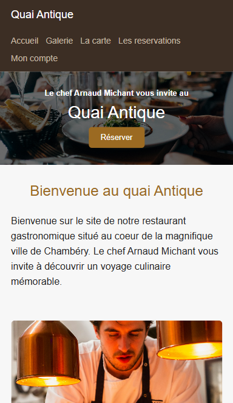
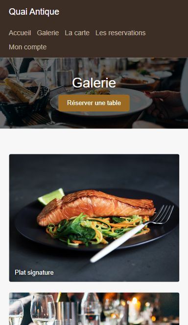
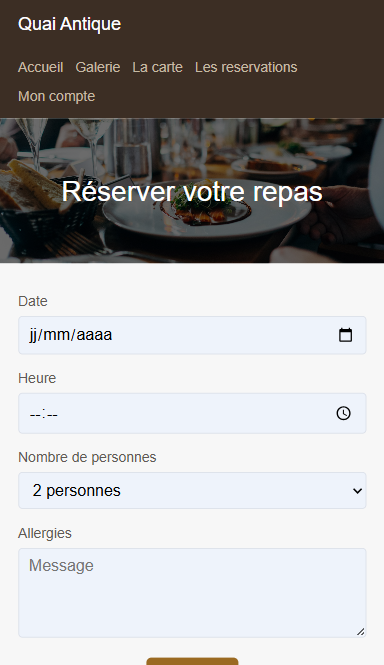

# PROJET QUAI ANTIQUE — PRÉSENTATION DE VALIDATION PÉDAGOGIQUE
**Version Intermédiaire — Première Remise Intermédiaire**  
*Développement par : Larisa Faessel — Mai 2026*

---

## SLIDE 1 : Page de Garde

### **Projet Quai Antique**
**Présentation de Validation Pédagogique — Version Intermédiaire en Développement**

---
* **Étudiante en Développement :** Larisa Faessel
* **Contexte pédagogique :** Examen étudiant — Première remise intermédiaire
* **État de l'application :** Frontend interactif et Backend Express connectés et fonctionnels !
* **Date de présentation :** Mai 2026
---

*Aperçu visuel de la page d'accueil :*  


---

## SLIDE 2 : 1. Présentation du projet

### **La Vision de Quai Antique**
En tant qu'étudiante, je présente le projet **Quai Antique**. Il s'agit d'une application web moderne conçue pour un restaurant gastronomique haut de gamme.

* **Description courte :**  
  Une application web élégante inspirée d'un restaurant de prestige permettant aux clients de découvrir l'établissement, de parcourir la carte de manière interactive et d'effectuer des réservations de tables en temps réel.
  
* **Objectifs principaux :**  
  Offrir une interface utilisateur haut de gamme (responsive et dynamique) couplée à un backend robuste pour la gestion sécurisée et fluide des demandes de réservation.
  
* **Contexte de première remise :**  
  Le projet est actuellement en cours de développement actif. La base technique est entièrement posée pour permettre de futures extensions rapides (authentification utilisateur complète et panneau d'administration).

---

## SLIDE 3 : 2. Cahier des charges (version simplifiée)

### **Besoins & Fonctionnalités**

#### **1. BESOIN CLIENT**
Disposer d'un site vitrine élégant et immersif permettant de consulter les plats, la galerie du restaurant et de faire une réservation de table en direct.

#### **2. FONCTIONNALITÉS INTERFACE (FRONTEND)**
* **Page d'accueil :** Présentation esthétique et bouton d'action d'appel à réservation.
* **La Carte / Menu :** Filtres interactifs par catégories (entrées, plats, desserts).
* **Galerie photos :** Grille adaptative pour afficher des photos en haute définition.
* **Connexion / Inscription :** Maquette de formulaires d'authentification.
* **Formulaire de réservation :** Saisie de la date, l'heure, du nombre de convives et des allergies.

#### **3. FONCTIONNALITÉS LOGIQUE (BACKEND & DB)**
* **API REST RESTful :** Serveur Express autonome pour intercepter les requêtes du frontend.
* **Validation rigoureuse :** Traitement et contrôle de conformité des données soumises côté serveur.
* **Table 'reservations' PostgreSQL :** Sauvegarde pérenne des réservations de table (identité, contact, allergies).

#### **4. CONTRAINTES TECHNIQUES**
* Adaptation fluide sur mobile, tablette et ordinateur de bureau (Responsive).
* Code modulaire structuré pour favoriser l'évolutivité (Architecture propre).
* Historique de commits régulier et propre (Versionnement Git).

---

## SLIDE 4 : 3. Technologies utilisées

### **Le Stack Technique**
Pour répondre aux exigences modernes du web, j'ai sélectionné et mis en œuvre des technologies stables et standardisées. L'accent a été mis sur la mise en place d'une architecture client-serveur découplée afin de préparer au mieux la transition vers de futurs frameworks.

| Couche Applicative | Technologies Choisies | Rôle & Justification Technique |
| :--- | :--- | :--- |
| **Frontend / Client** | HTML5, CSS3, JavaScript (ES6+) | Structure sémantique, styles réactifs (CSS Grid/Flexbox) et requêtes asynchrones Fetch API. |
| **Backend / API** | Node.js, Express, CORS | Serveur HTTP structuré, routage REST, middleware de sécurité CORS pour l'intégration. |
| **Base de Données** | PostgreSQL (Supabase Cloud), `pg` | Stockage relationnel, intégrité référentielle, connexion par pool robuste pour la performance. |
| **DevOps & Outils** | Git / GitHub, Docker (Nginx), VS Code | Contrôle des versions, conteneurisation pour le serveur statique local, environnement homogène. |

---

## SLIDE 5 : 4. Avancement du projet

### **Suivi des Fonctionnalités**

| Fonctionnalité principale | Détail Technique & Implémentation | Statut actuel |
| :--- | :--- | :--- |
| **Page d'accueil & Vitrine** | Page structurée avec hero-bannière élégante et styles groupés. | **✓ Réalisé & Validé** |
| **La Galerie des Plats** | Grille responsive avec photos HD chargées localement. | **✓ Réalisé & Validé** |
| **La Carte & Menus** | Onglets interactifs dynamiques animés en JavaScript (`app.js`). | **✓ Réalisé & Validé** |
| **Formulaire de réservation** | Formulaire utilisateur avec validation locale et retour visuel. | **✓ Réalisé & Validé** |
| **API Backend Express** | Routage REST (`/api/reservations`), routage de santé (`/api/health`). | **✓ Réalisé & Validé** |
| **Connexion PostgreSQL** | Base de données Supabase connectée, script SQL de création de table. | **✓ Réalisé & Validé** |
| **Liaison Formulaire → DB** | Envoi des données POST JSON du Frontend vers le Backend Express. | **✓ Intégré & Fonctionnel** |
| **Comptes & Espace Admin** | Maquette existante. Sécurisation bcrypt, authentification JWT et panel admin. | **△ Étape 2 (En cours)** |

---

## SLIDE 6 : 5. Architecture technique

### **Flux de communication Client-Serveur**
L'application implémente une architecture découpée en couches de type Client-Serveur. La communication entre le Frontend et le Backend est asynchrone et repose sur le format standard JSON.

#### **Schéma logique d'exécution :**
```text
  +-----------------------+              +-------------------------+              +-------------------------+
  |    FRONTEND CLIENT    |              |   BACKEND API EXPRESS   |              |    BASE DE DONNÉES     |
  |                       |  Fetch POST  |                         | pg Pool SQL  |                         |
  |  HTML5 / CSS3 / JS    | ------------>|  Node.js / Express App  | ------------>|  PostgreSQL (Supabase)  |
  |  (Formulaire Saisi)   |  (JSON Body) |  (Validations & CORS)   |  (Query SQL) |  (Table reservations)   |
  +-----------------------+              +-------------------------+              +-------------------------+
```

#### **Fonctionnement détaillé de l'intégration :**
1. **Saisie :** L'utilisateur remplit le formulaire de réservation sur l'interface (Date, heure, invités, allergies).
2. **Requête :** Le script JavaScript (`app.js`) intercepte la soumission, valide les types de données et effectue une requête Fetch API en `POST JSON` vers le port `3003`.
3. **Traitement :** Le serveur Express intercepte la requête, applique les validations côté serveur (ex: nombre de convives > 0) et transmet les données au repository.
4. **Persistance :** Le repository exécute une requête préparée via un pool de connexions (`pg`) vers PostgreSQL (Supabase) pour y insérer les informations de manière sécurisée.

---

## SLIDE 7 : 6. Captures d'écran : Interface Frontend

### **Aperçu des Écrans Principaux**
L'interface utilisateur a été conçue pour refléter le standing d'un restaurant gastronomique. Les couleurs et polices ont été choisies avec soin (combinaison de tons sombres et dorés). Le site s'adapte de manière totalement automatique sur smartphone, tablette et écran large.

#### **1. Page d'accueil :**
*Bannière de présentation chaleureuse et raffinée.*  


#### **2. La Galerie photos :**
*Présentation responsive des créations culinaires.*  


#### **3. Formulaire de réservation :**
*Interface simple et intuitive de réservation de table.*  


---

## SLIDE 8 : 6. Architecture de code : Contrôleur Backend & DB

### **Règles Métier & Intégrité**
Afin de garantir un code maintenable et réutilisable, le бэкенд Express est organisé selon le patron Repository :

* **`controllers/reservation.controller.js` :**  
  Gère le traitement de la requête HTTP, extrait les paramètres de réservation, valide que tous les champs obligatoires sont bien remplis, applique des règles métier (ex: vérifier que le nombre de personnes est bien un entier strictement positif) et renvoie la réponse correspondante (201 Created ou codes d'erreur 400, 500, 503).
  
* **`repositories/reservation.repository.js` :**  
  Se charge exclusivement des interactions SQL avec PostgreSQL via des requêtes paramétrées sécurisées prévenant les injections SQL.
  
* **`config/database.js` & `initDatabase.js` :**  
  Gère la connexion sécurisée par pool `pg` et crée automatiquement la table `reservations` au lancement du serveur avec reconnexion automatique en cas d'indisponibilité.

#### **Extrait de code du contrôleur de réservation :**
```javascript
// controllers/reservation.controller.js
async function createReservation(req, res) {
  const { firstName, lastName, email, date, time, guests, allergies } = req.body;

  if (!firstName || !lastName || !email || !date || !time || !guests) {
    return res.status(400).json({
      message: 'Tous les champs obligatoires doivent etre remplis'
    });
  }

  const guestCount = Number(guests);
  if (!Number.isInteger(guestCount) || guestCount <= 0) {
    return res.status(400).json({
      message: 'Le nombre de personnes doit etre un nombre entier positif'
    });
  }

  try {
    const reservation = await reservationRepository.createReservation({
      firstName, lastName, email, date, time, guests: guestCount, allergies
    });
    return res.status(201).json({ message: 'Reservation enregistree', reservation });
  } catch (error) {
    if (error.message.includes('DATABASE_URL')) {
      return res.status(503).json({ message: 'Base de donnees indisponible' });
    }
    return res.status(500).json({ message: 'Erreur lors de l enregistrement' });
  }
}
```

---

## SLIDE 9 : 7. Gestion des versions : Git & GitHub

### **Méthodologie de Versionnement**
Le suivi des versions est un pilier de mon apprentissage. Dès le début du projet, j'ai mis en place un dépôt Git local et je l'ai connecté à mon compte GitHub afin de sauvegarder mon travail et de le rendre disponible pour la validation pédagogique.

* **Organisation des commits :** Chaque commit correspond à une tâche claire et unitaire de développement. Les messages de commit respectent les conventions afin de faciliter la lecture de l'historique.
* **Sécurisation du code :** J'ai veillé à mettre en place un fichier `.gitignore` robuste pour empêcher la fuite de secrets ou de dépendances lourdes (exclusion de `node_modules`, des fichiers `.env` de configuration locale contenant les identifiants de la base de données).

#### **Dernier historique Git du projet (Terminal) :**
```bash
$ git log -n 4

commit a3db5b7b29722234947b3e859ae58e804eeaece9
Author: Larisa Faessel <faessel.larisa@gmail.com>
Date:   Wed May 20 15:10:59 2026 +0200

    feat: connect reservation form to backend and database

commit 3775f613cc6e69c3ae4624fe19056fc048a6c830
Author: Larisa Faessel <faessel.larisa@gmail.com>
Date:   Wed May 20 11:37:04 2026 +0200

    Test backend API routes

commit d5656dc31774aa6f1d0533e7239537890df40004
Author: Larisa Faessel <faessel.larisa@gmail.com>
Date:   Tue May 19 17:46:23 2026 +0200

    fix backend startup

commit 92ce0119a780e97e445d92b94d40763bb3f32ae7
Author: Larisa Faessel <faessel.larisa@gmail.com>
Date:   Tue May 19 17:24:18 2026 +0200

    add backed Node.js Express
```

* **Dépôt GitHub :** https://github.com/catcodecat/Quai_Antique_Project  
* **Site Vitrine Déployé :** https://quai-antique-projet.netlify.app/

---

## SLIDE 10 : 8. Difficultés rencontrées et solutions

### **Retour d'expérience étudiante**
En tant qu'étudiante en développement web, ce projet Quai Antique a été une formidable opportunité d'apprentissage mais aussi un vrai défi technique. Voici les principales difficultés que j'ai rencontrées et comment j'ai réussi à les surmonter :

* **La gestion de la politique de sécurité CORS :**  
  *Difficulté :* Lors des premiers tests de soumission du formulaire de réservation depuis mon frontend statique, les navigateurs bloquaient les requêtes à cause des règles de sécurité CORS (Cross-Origin Resource Sharing).  
  *Solution :* J'ai surmonté cela en configurant correctement le middleware `cors` côté Express pour autoriser spécifiquement mon origine locale de développement (`http://localhost:8080`).
  
* **L'intégration et la résilience de la base de données :**  
  *Difficulté :* Établir la connexion avec PostgreSQL (Supabase) a nécessité de bien appréhender l'asynchronisme de JavaScript. Si la base de données mettait du temps à s'éveiller au démarrage (mode veille cloud), le serveur Express plantait.  
  *Solution :* J'ai implémenté un système robuste de reconnexion automatique (jusqu'à 5 tentatives avec intervalle d'attente asynchrone) dans mon script d'initialisation de base de données `initDatabase.js`.
  
* **La validation rigoureuse des données :**  
  *Difficulté :* Assurer que seules des réservations valides et saines soient stockées en base (sécurité de type et cohérence des valeurs).  
  *Solution :* J'ai mis en place une double couche de validation : dans le formulaire frontend HTML5 et dans le contrôleur backend Express (contrôle de type et de valeurs numériques), assurant la qualité et la sécurité de la donnée.

---

## SLIDE 11 : 9. Prochaines étapes du développement

### **Plan de Travail pour l'Étape 2**

#### **1. SÉCURISATION ET AUTHENTIFICATION DES COMPTES CLIENTS**
* Implémenter le hachage sécurisé des mots de passe dans la base de données avec la bibliothèque `bcrypt` côté бэкенд.
* Générer et valider des jetons sécurisés JWT (JSON Web Tokens) lors de la connexion pour maintenir la session de l'utilisateur.
* Protéger les routes sensibles de l'API REST grâce à des middlewares d'authentification personnalisés.

#### **2. DÉVELOPPEMENT DU PANNEAU D'ADMINISTRATION COMPLET**
* Créer des écrans d'administration permettant de modifier dynamiquement les plats de la carte, les prix et les descriptions.
* Gérer les jours et horaires d'ouverture du restaurant de manière interactive.
* Pouvoir consulter, filtrer et valider/annuler les demandes de réservations des clients.

#### **3. REFACTORISATION ET MIGRATION COMPOSANTS REACT + VITE**
* Refactoriser le frontend statique HTML/CSS/JS actuel dans un projet moderne React + Vite pour un développement plus fluide.
* Découper l'interface utilisateur en composants autonomes et réutilisables (ex: `Header`, `Footer`, `MenuTabs`, `ReservationForm`).
* Utiliser React Router pour gérer de manière transparente et performante la navigation entre les pages sans rechargement.

#### **4. DÉPLOIEMENT FINAL DE L'APPLICATION EN PRODUCTION**
* Déployer la base de données de production PostgreSQL sur Supabase.
* Héberger l'API REST Express sur une plateforme de cloud (Render ou Fly.io) avec des variables d'environnement chiffrées.
* Publier le frontend React sur Netlify avec des redirections configurées pour les requêtes API.

---

## SLIDE 12 : Conclusion de l'étudiante

### **Synthèse de cette première remise**
Cette première phase de développement du projet **Quai Antique** a été extrêmement enrichissante.

Partie d'une idée de site vitrine statique, j'ai réussi à mettre en œuvre une véritable architecture applicative web. L'interface utilisateur est entièrement responsive et interactive. Le бэкенд Express est opérationnel, gère correctement les validations côté serveur et communique de manière fluide avec la base de données PostgreSQL.

La base technique est solide, saine et robuste. Le projet est parfaitement prêt pour cette première validation pédagogique intermédiaire, et me permettra d'aborder sereinement les prochaines étapes de sécurisation et de migration React.

Je remercie mon professeur pour sa lecture et ses précieux conseils pédagogiques tout au long de mon projet d'examen !

---
*Présentation rédigée avec rigueur par :*  
**Larisa Faessel**  
*Étudiante en Développement Web*
