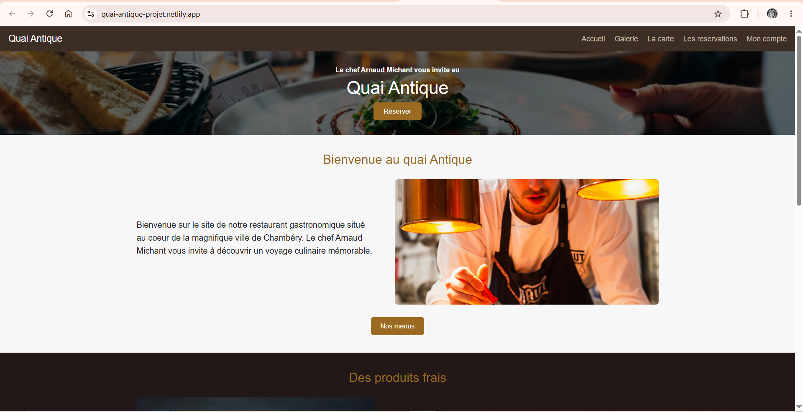
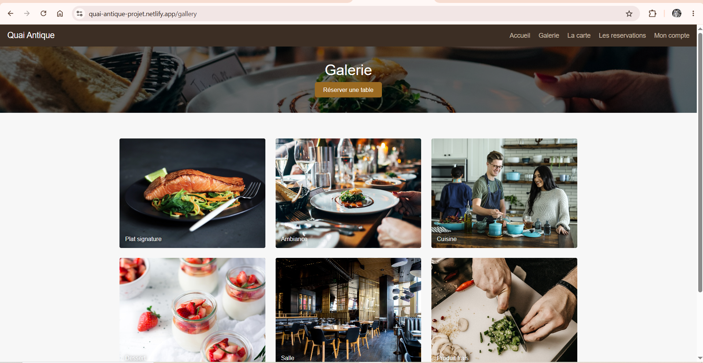
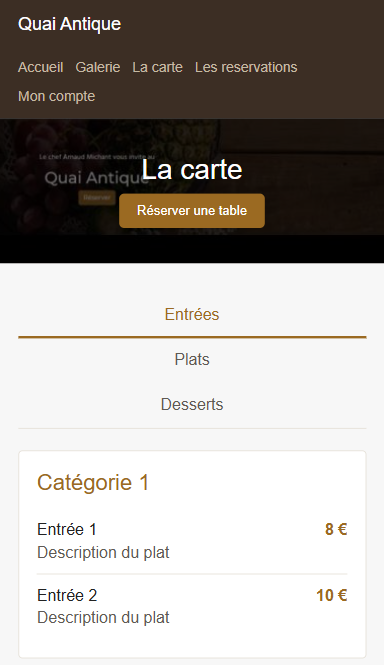
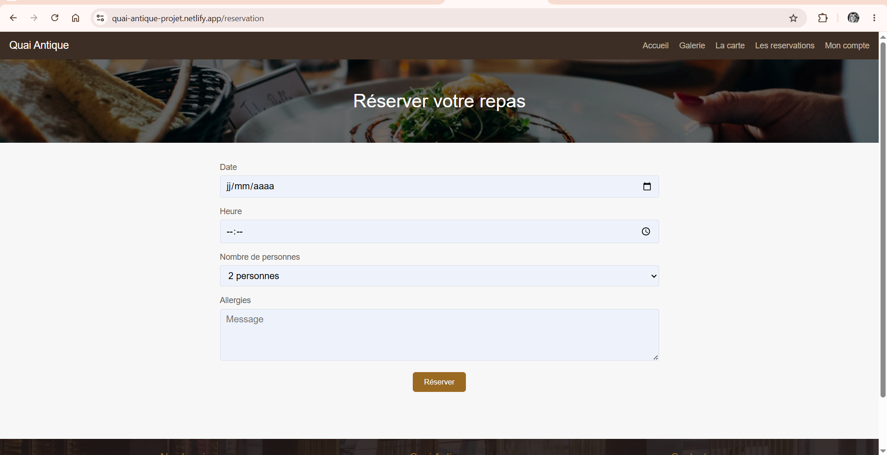
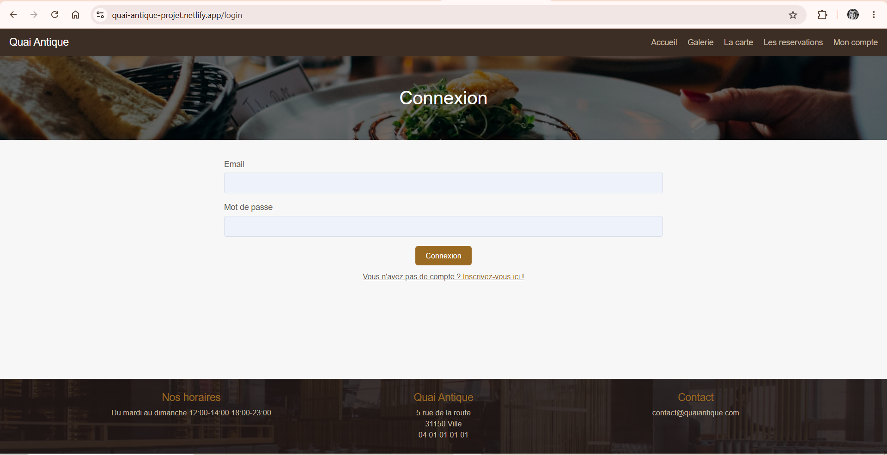
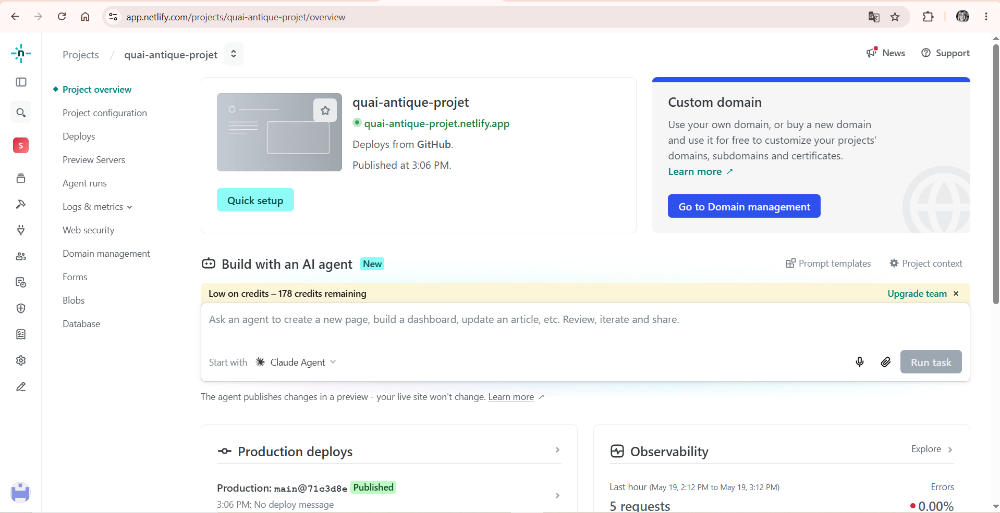
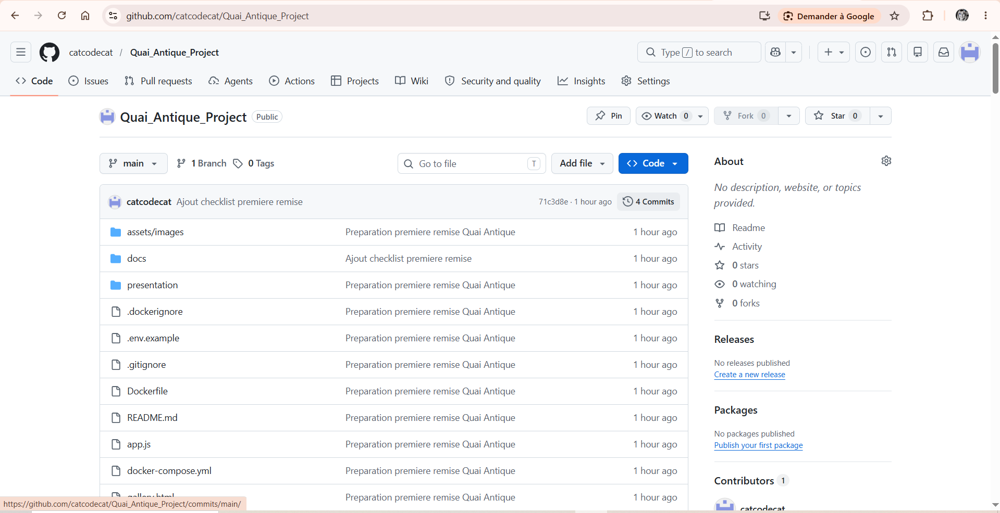

# Quai-Antique

## Présentation courte du projet

Je présente le projet **Quai-Antique**, un site web réalisé dans le cadre de ma formation. Pour cette première vérification, le projet est encore en cours de développement. Il contient surtout une première interface en HTML, CSS et JavaScript, avec une documentation de base pour expliquer la suite du travail.

## Objectif du site

L'objectif du site est de présenter un restaurant fictif appelé Quai-Antique. Le site doit permettre aux visiteurs de découvrir le restaurant, consulter la galerie, regarder la carte et préparer une réservation.

## Contexte pédagogique

Ce projet me permet de travailler l'organisation d'un projet web, la création de pages HTML, la mise en forme avec CSS, un peu d'interactivité avec JavaScript, ainsi que la préparation d'une documentation claire pour expliquer mon travail.

## Cahier des charges simplifié

Pour cette première version, je dois montrer :

- une page d'accueil ;
- une galerie ;
- une page menu ;
- une page réservation ;
- une page connexion ;
- une base de documentation ;
- une organisation Git ;
- une configuration Docker simple ;
- les premières idées pour le backend, la base de données et la sécurité.

## Fonctionnalités prévues

Les fonctionnalités prévues pour la suite sont :

- inscription et connexion utilisateur ;
- vraie réservation enregistrée en base de données ;
- gestion des menus et des plats ;
- espace administrateur ;
- affichage des horaires ;
- validation des formulaires ;
- sécurisation des données utilisateur.

## Fonctionnalités déjà réalisées

Actuellement, le projet contient :

- les pages principales en HTML ;
- une navigation entre les pages ;
- une mise en page CSS ;
- une adaptation mobile de base ;
- des onglets JavaScript sur la page menu ;
- des messages simples après l'envoi des formulaires ;
- des captures d'écran ;
- une documentation de première remise.

## Technologies utilisées

Pour cette première version, j'utilise :

- HTML5 ;
- CSS3 ;
- JavaScript ;
- Git ;
- Docker avec Nginx pour servir le site statique ;
- Netlify pour le déploiement ;
- GitHub pour le dépôt du projet.

Je ne migre pas encore vers React/Vite pour cette première vérification. Je garde volontairement la structure HTML/CSS/JavaScript actuelle.

## Structure des fichiers du projet

```text
Quai_Antique_Project/
├── assets/images/
├── docs/
├── presentation/
├── screens/
├── app.js
├── gallery.html
├── index.html
├── login.html
├── menu.html
├── register.html
├── reservation.html
├── styles.css
├── README.md
├── Dockerfile
├── docker-compose.yml
├── .gitignore
└── .env.example
```

## Sécurité prévue

La sécurité n'est pas encore complète car le backend n'est pas encore développé. Pour la suite, je prévois :

- hash des mots de passe avec `bcrypt` ;
- authentification avec JWT ou session ;
- variables d'environnement dans `.env` ;
- validation des formulaires côté frontend et backend ;
- protection CORS ;
- protection contre les injections ;
- gestion des rôles utilisateur et administrateur ;
- protection des données sensibles sur GitHub.

## Backend et base de données prévus

Le backend n'est pas encore réalisé. Je prévois de le développer avec Node.js et Express.

La base de données devra contenir par exemple :

- utilisateurs ;
- réservations ;
- menus ;
- plats ;
- horaires ;
- avis.

Ces éléments sont expliqués dans les fichiers de documentation du dossier `docs/`.

## Docker / GitHub / Netlify

Docker est ajouté pour lancer le site avec un serveur Nginx simple. GitHub sert à versionner le projet et Netlify sert à montrer une version déployée du site.

## Liens du projet

- GitHub : https://github.com/catcodecat/Quai_Antique_Project
- Netlify : https://quai-antique-projet.netlify.app

## État actuel du projet

Le projet est une première version fonctionnelle côté interface. Les pages existent et permettent déjà de montrer l'idée générale du site. Par contre, les formulaires ne sont pas encore reliés à une API, et aucune donnée n'est encore enregistrée en base.

## Ce que je présente au professeur

Pour cette première vérification, je présente une première version du site Quai-Antique. Le projet contient actuellement une interface HTML/CSS/JavaScript, une documentation de base, une configuration Docker simple et les premiers éléments nécessaires pour expliquer la suite du développement.

## Captures d'écran

### Page d'accueil



### Page galerie



### Page menu



### Page réservation



### Page connexion



### Déploiement Netlify



### Repository GitHub



## Fichiers nécessaires pour montrer le projet au professeur

- `README.md`
- `presentation/presentation-quai-antique.html`
- `presentation/presentation-quai-antique.md`
- `screens/`
- lien GitHub
- lien Netlify
- `Dockerfile`
- `docker-compose.yml`
- `.gitignore`
- `.env.example`
- documentation dans `docs/`

## Prochaines étapes

Avant la remise finale, il me restera à :

- améliorer certaines parties de l'interface si nécessaire ;
- créer le backend Express ;
- créer la base de données ;
- connecter les formulaires ;
- ajouter une vraie authentification ;
- créer l'espace administrateur ;
- renforcer la sécurité ;
- vérifier le déploiement final.

## Conclusion de l'étudiant

Cette première version me permet de montrer la base du projet Quai-Antique. Le site n'est pas encore terminé, mais il contient déjà les pages principales, une première organisation de fichiers, des captures d'écran, une documentation et les liens GitHub et Netlify. La prochaine étape sera de transformer cette base en application plus complète avec un backend et une base de données.
